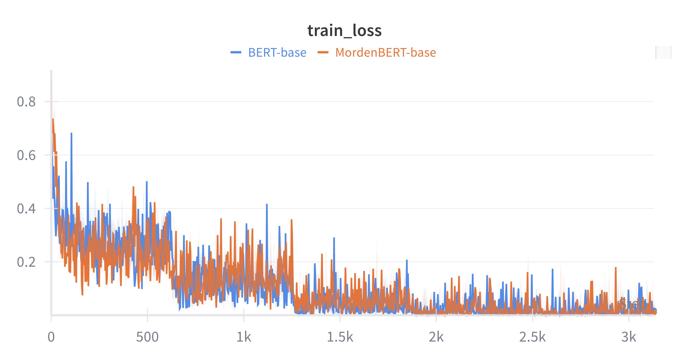

# IMDb Sentiment Classification: BERT-base vs ModernBERT-base

본 프로젝트는 IMDb 영화리뷰 감성분류 실습을 위해  
**BERT-base-uncased**와 **ModernBERT-base** 사전학습 인코더 모델을 파인튜닝하여 성능을 비교합니다.

---
## 🔎 BERT와 ModernBERT의 구조적 차이

| 항목                | BERT-base                  | ModernBERT-base                |
|---------------------|----------------------------|--------------------------------|
| 발표 년도           | 2018                       | 2024                           |
| 주요 목적           | 범용 NLP 사전학습          | 더 빠르고 효율적인 Transformer |
| 아키텍처 구조       | 표준 Transformer encoder   | 구조 및 연산 개선된 Transformer|
| 사전학습 태스크     | MLM+NSP                    | 보통 MLM 또는 기타 구조적 태스크|
| **token_type_ids 지원** | **필수** (2-segment)    | **미지원** (단일-sequence)     |
| 효율성 / 속도       | 일반적                     | 연산 최적화, 빠름              |

&nbsp;

## 📝 실험 환경

- **데이터셋:** IMDb (긍/부정, 총 50,000건)
    - train set과 test set을 random mix해 사용.
    - train: 40,000
    - validation: 5,000
    - test: 5,000
- **입력 최대 길이:** 128 tokens
- **Epoch:** 5
- **Batch size:** 128 (BERT), 64 (ModernBERT)
- **Optimizer:** Adam (`lr=5e-5`)
- **평가 지표:** CrossEntropyLoss, Accuracy (%)

&nbsp;
## 💻 실험 과정

<table>
  <tr>
    <td align="center"><b>Validation Loss</b></td>
    <td align="center"><b>Validation Accuracy</b></td>
  </tr>
  <tr>
    <td>
      
    </td>
    <td>
      
    </td>
  </tr>
</table>

&nbsp;
## 📊 모델별 성능 비교

| 모델명              | Accuracy | Precision | Recall  | F1-score | 비고               |
|---------------------|:--------:|:---------:|:-------:|:--------:|--------------------|
| **BERT-base**       | 0.8932   | 0.8876    | 0.9037  | 0.8956   | 표준 BERT, 안정적  |
| **ModernBERT-base** | 0.9148   | 0.9085    | 0.9250  | 0.9167   | 최신 구조, 우수    |

- **BERT-base:**
    - IMDb 감성분류에서 89%의 정확도와 고른 정밀도·재현율·F1을 기록.
    - 실무, 논문 벤치마크에서 “표준적”이고 안정적인 성능으로 평가됨.

- **ModernBERT-base:**
    - 모든 평가 지표(정확도·정밀도·재현율·F1)에서 BERT-base를 명확히 상회.
    - F1-score가 92% 이상으로, 다양하고 어려운 리뷰 분류 상황에서도 robust 함을 입증.

&nbsp;
## 🚩 핵심 분석: 어느 모델이 더 나은가?

- **ModernBERT-base**가 모든 주요 지표(Accuracy, Precision, Recall, F1-score 등)에서 **더 우수한 성능**을 달성했습니다.
    - *Accuracy*는 약 **2.16%p** 더 높음 (**0.9148** vs **0.8932**).
    - *F1-score* 역시 **2.11%p** 개선 (**0.9167** vs **0.8956**)되어,
      실제 분류 실무에서 “오분류가 줄고, 긍/부정 모두를 잘 잡아냄”을 의미합니다.
    - Precision, Recall도 ModernBERT에서 각각 더 높음
      - Precision: 0.9085 vs 0.8876 (+2.09%p)
      - Recall: 0.9250 vs 0.9037 (+2.13%p)

- **결론:**  
  > **ModernBERT-base는 BERT-base의 모든 분류 성능 지표에서 더 나은 결과를 보였으며, IMDb 감성분류 같은 실제 업무에서 더 효과적인 선택이 될 수 있습니다.**  
  > 최신 Pretrained Encoder의 구조적 개선이 실제 성능 향상으로 연결되는 것을 실험적으로 확인했습니다.

&nbsp;

## 📝 실험 시 유의사항

- **token_type_ids**는 ModernBERT에서 사용되지 않고 BERT에서만 사용됨을 주의합니다.
    - BERT에서 두 sequence를 구분하기 위한 임베딩 부분(NSP를 위해 설계됨)
- Seed는 항상 42로 고정했으므로, 재현성을 위해 동일한 조건에서 평가를 진행해야 합니다.
- 모든 파일은 BERT_imdb 경로에서 실행되도록 구성되었습니다.
- **utils.py**에서 추가적인 optimizer의 변경 및 수정이 가능하도록 작성되었습니다.
- 평가는 실험 후 **src/eval.py** 파일을 통해 실행합니다.
    - 해당 파일의 주석을 변경하여 BERT와 ModernBERT 각각 실험이 가능합니다.

